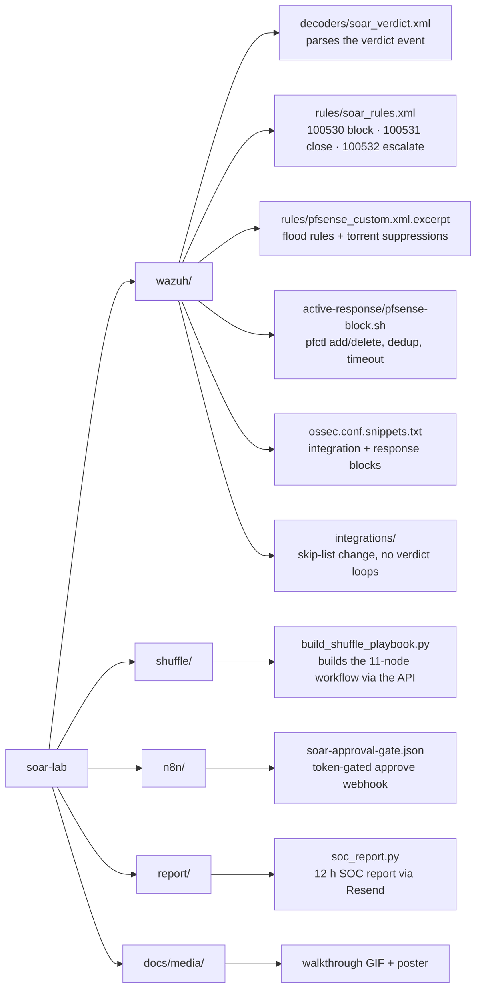
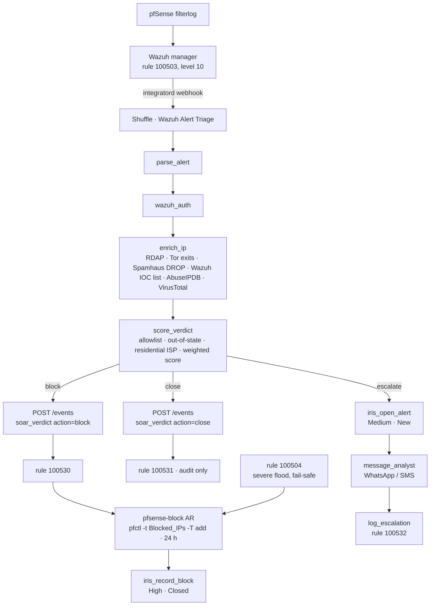
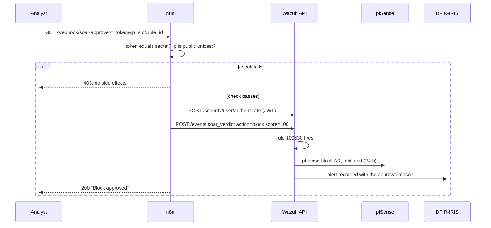

# soar-lab

A SOAR layer between a SIEM detection and a firewall block, built on open-source parts and running in a home lab.

Wazuh detects inbound floods on a pfSense WAN and used to block the source for 24 hours with no context: the same rule treated a scanner and a large CDN the same way. This project puts enrichment, an allowlist, a score and a human gate in front of that action, and records every outcome in a case manager.

Full video: https://customer-gb6ix8koycqn490d.cloudflarestream.com/5ab70384b3fc940a22620867b5ebcb22/watch

## The pipeline

| Stage | Component | What happens |
|---|---|---|
| 01 Detect | Wazuh | pfSense filterlog is decoded; the moderate flood rule (level 10) posts alert JSON to a Shuffle webhook instead of blocking. A severe flood rule still blocks directly as a fail-safe. |
| 02 Enrich | Shuffle | RDAP organisation, Tor exit list, Spamhaus DROP, FireHOL level1, abuse.ch SSLBL, the lab's own 40k-entry Wazuh IOC list (read through the Wazuh API), Shodan InternetDB and AlienVault OTX (both keyless). AbuseIPDB and VirusTotal are used when keys are present, GreyNoise only when both of those fell away. Every keyed or quota-bound lookup sits behind a per-IP 24 hour cache, a cheap-gate (no lookups for traffic the scorer will close anyway), a per-replica daily budget, a per-minute throttle for VirusTotal, and a 15 minute cooldown after any 429. Skipped lookups are written into the verdict reason as `degraded:` so an escalation shows what it ran without. Bulk feeds are cached for an hour. |
| 03 Score | Shuffle | Allowlist and an out-of-state check first (source port 80/443 to a high destination port is return traffic, not an attack), then weighted signals to a score. |
| 04 Act | Wazuh | The verdict is posted back into Wazuh as an event. Three rules turn it into block, close or escalate alerts. Only the block rule is wired to the existing pfSense active response, so timeout, dedup and audit stay in one place. |
| 05 Record | DFIR-IRIS | Every block and escalation lands as an IRIS alert with the IOC, the enrichment and the Wazuh context. Escalations carry a one-click, token-gated approve link served by n8n and a WhatsApp push to the analyst. |

### Verdicts

- **Block**: score at or above the threshold and a public IP. Rule 100530 drives the pfSense response: `pfctl -t Blocked_IPs -T add`, WAN inbound only, 24 hour expiry.
- **Close**: allowlisted range or organisation, or return traffic. Logged at a low level, nothing happens.
- **Escalate**: no findings and not allowlisted. IRIS alert (Medium, New), WhatsApp message, approve link. A human decides.

### Guardrails

- Private ranges, CGNAT, CDN and tunnel ranges and the media server are allowlisted before any scoring.
- The block rule applies to WAN inbound only, so established sessions survive a wrong block.
- Verdict rules are excluded from the Shuffle integration, so a verdict can never trigger a second run.
- Every block expires after 24 hours; permanent blocks need a human.
- The approve path never touches the firewall directly. It can only ask Wazuh to raise the rule the automation already uses.

## Repository layout

## How the pieces talk

### Approval gate

## Install

1. **Wazuh manager**: copy `wazuh/decoders/soar_verdict.xml` and `wazuh/rules/soar_rules.xml` into `/var/ossec/etc/{decoders,rules}/`, add the snippets from `wazuh/ossec.conf.snippets.txt` to `ossec.conf` (Shuffle integration at level 10, `pfsense-block` response on your severe flood rule plus 100530), apply the skip-list change in `integrations/shuffle.py`, then `systemctl restart wazuh-manager`. Test with `wazuh-logtest`.
2. **Shuffle**: log in, note the webhook id of a workflow with a Webhook trigger, set `WF_ID` in `shuffle/build_shuffle_playbook.py`, and run it with your secrets on the command line:
   `python3 build_shuffle_playbook.py wazuh_api_pass=... iris_api_key=... twilio_sid=... twilio_token=... approve_url_base=https://n8n.example/webhook/soar-approve?t=...`
   Nothing secret is stored in the script. Optional: `abuseipdb_key`, `virustotal_key`, `greynoise_key`, `otx_key`.
3. **n8n**: import `n8n/soar-approval-gate.json`, replace `<approve-token>` and the Wazuh Basic header, activate.
4. **DFIR-IRIS**: any 2.4 instance; the playbook posts to `/alerts/add` with the API key from the workflow variables.
5. **Report**: `report/soc_report.py` on the manager with a mode-600 env file (`RESEND_KEY`, `IRIS_API_KEY`, `IRIS_URL`, `REPORT_TO`), cron twice a day.

## Test it

Post three synthetic alerts to the webhook and watch the three branches: a CDN address with source port 443 (close), a Tor exit that is on your IOC list (block, in the pfSense table within a second), and a documentation-range address (escalate, IRIS alert, message). The builder's docstring shows the alert shape Wazuh's integratord sends.

## What was learned

- Counting the wrong rule made the old report say "0 firewall blocks" for months: rule 100501 is level 2 and never reaches `alerts.json`. Count the response log and the verdict rules instead.
- Shuffle wraps every node result in `{"success": true, "message": {...}}`, so cross-node references are `$node.message.field`.
- Form-encoded bodies need real URL encoding; a raw `+` in a phone number becomes a space.
- Public reputation feeds rate-limit fast once real alerts flow; cache them.

All addresses, hostnames and identifiers in this repository are documentation values. Replace them with your own.

## Licence

MIT. Built by Scott Schlangen, soc-lab.io.
